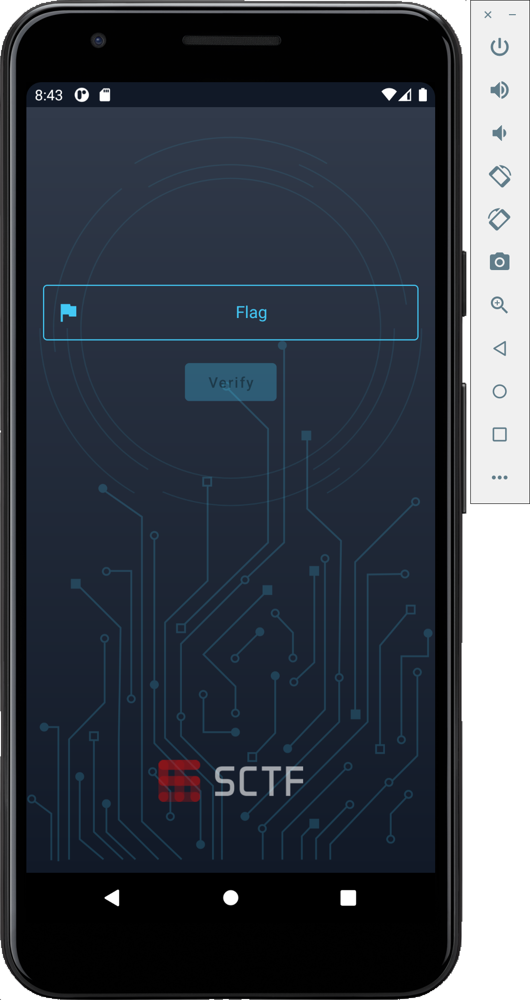
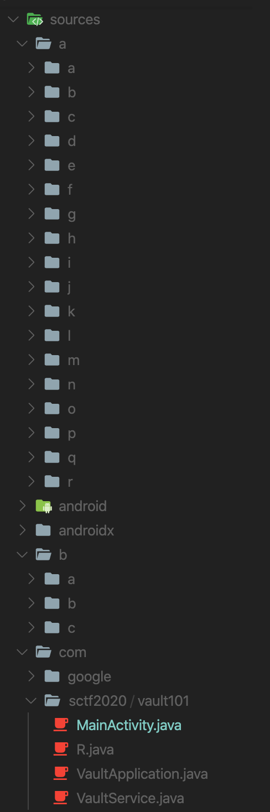

> 안녕하세요 뉴비입니다.

# REV

## Vault 101

### Analyze

우선 apk파일을 다운 받아주고 열어준다.


열면 대충 이렇게 생겼다.

플래그를 알아내면 되는 듯 하다.

jadx로 까보면 아래와 같다.



그렇다... 난독화가 되어있다.

[메니페스트](src/vault101/AndroidManifest.xml)를 읽어보면 서비스가 돌아가고 있다.

```xml
<service android:name="com.sctf2020.vault101.VaultService" android:enabled="true" android:exported="true"/>
<activity android:name="com.sctf2020.vault101.MainActivity">
    <intent-filter>
        <action android:name="android.intent.action.MAIN"/>
        <category android:name="android.intent.category.LAUNCHER"/>
    </intent-filter>
</activity>
```

[메인 엑티비티 파일](src/vault101/MainActivity.java)에 onClick을 보면 
```java
boolean a2 = this.s.a(this.p.getText().toString());
```
이런 부분이 있고, 앞뒤를 보면 a2를 true로 만들어야 할 것 같다.

s는 Service로 초기화 되어있고, 
s.a의 구현부는 [`VaultService.java`](src/vault101/VaultService.java)에서 확인할 수 있다.

뭔가... 많이 복잡하다.

간단하게 앱을 하나 만들어서 해결하는 방법이 있겠지만 하나하나 분석을 하겠다.

```java
public boolean a(String str) {
    try {
        int i = this.f874a + 1;
        this.f874a = i;
        if (i > 3) {
            Class.forName(c.d(";È\u0003p¯…4ŶorÂ\"Ý\u0010|", -500953648)).getMethod(c.d("qó%", 991422357), new Class[]{(Class) Class.forName(c.d("~jxe\u0005reíY:Bè`niaY", 1069257791)).getDeclaredField(c.d("\u0001ò¬\u0010", 1659367412)).get((Object) null)}).invoke((Object) null, new Object[]{0});
            return false;
        } else if (str == null) {
            return false;
        } else {
            Object b2 = b.c.a.a.b((byte[]) Class.forName(c.d(".®$\u000fß1Ç\u0003?ڙ6ʶ\"", 1451800421)).getMethod(c.d("7Ì£\u0002rØ0X", -552283301), new Class[0]).invoke(str, new Object[0]));
            Object invoke = Class.forName(c.d("aogrfle¯}qjì.Cbsl35", 823239689)).getMethod(c.d("$OX{Í\u0010", -2050089752), new Class[]{Class.forName(c.d("\u000eé", 937562454)), (Class) Class.forName(c.d(";HCp¯\u0005tå¶ohõ%LRtó", -730536752)).getDeclaredField(c.d("\u0014ø¡\u0014", -1215097919)).get((Object) null)}).invoke((Object) null, new Object[]{b2, Class.forName(c.d("pç\u000bfÆ´!\rÌ!BZ?Ë\u000egÌëq", -1393972808)).getDeclaredField(c.d("\u001aä‰\u0017Yï\u0004", 1778992991)).get((Object) null)});
            Object newInstance = Class.forName(c.d("~jxe\u0005remY:Xrfb`c", 1356052543)).getConstructor(new Class[]{Class.forName(c.d("[C", 591904395))}).newInstance(new Object[]{invoke});
            Object invoke2 = Class.forName(c.d("$Í\u001efƞ4\u0007Ž:EH Í\u000e:ê˜>]ˆ-_", -248372756)).getMethod(c.d("&DÇ\u0003ÿ\u0016xg¬", 64103114), new Class[]{(Class) Class.forName(c.d("/BNt\u001fqç‚`ó1F_pÓ", -401453852)).getDeclaredField(c.d("\u0001ò\u0004D", 195131734)).get((Object) null)}).invoke(VaultService.this, new Object[]{Integer.valueOf(R.string.magic)});
            return ((Boolean) Class.forName(c.d("zhs`-ddmu.Rwb`kf", -754317293)).getMethod(c.d("tø\u001auÅ®", 528601528), new Class[]{Class.forName(c.d("oâœ5…º!OÈzä\u0016oæ‰ ", -1620091986))}).invoke(invoke2, new Object[]{newInstance})).booleanValue();
        }
    } catch (Throwable unused) {
        throw new RuntimeException();
    }
}
```
[`b.c.a.c.d`](src/vault101/c.java)는 난독화 된 것을 푸는 것으로 보인다.
설마 이걸 해석하겠다고??? 절대 안 할거다. 절대 절대 절대

그냥 한 가지 알아둘 것은 statc으로 f823a라는 변수가 있는데,
[`VaultApplication`](src/vault101/VaultApplication.java)에서 1로 초기화 된다는 것이다.


자바 어플리케이션을 만들어서 모든 글자를 치환해 보겠다. (그럴거면 안드 앱을 만드는 게 더... 나을 수도..는 이유가 있음)


복호화 하는 코드는 [여기](src/vault101/decrypt.java)를 참조

전부다 복호화가 잘 이루어지진 않아서 몇개는 수동으로 했다.
복호화 된 코드는 [여기](src/vault101/VaultService%20copy.java)에 있다.


처음 exit가 있는 곳은 flag 입력이 세번 실패하면 종료하는 코드이고,
밑에 else 문이 실제로 체크하는 부분이다.

약간 생긴 모습이 pyjail을 하는 모습과 닮았다.

자바에서 리플렉트를 해봤으면 익숙한 것이다.

[이것](src/vault101/VaultService%20copy%202.java)이 현재 작성된 것을 해석한 것이다.

설명을 덧 붙이자면,
* Class.forName은 string으로부터 클래스를 가져오는 것,
* getMethod는 첫번째 인자는 메소드 이름, 두번째 인자는 메소드 인자
* invoke는 메소드(첫번째 인자를 self로), 함수 실행
* getDeclaredField는 멤버를 가져오는 것이다.
* javalang.Integer.TYPE == int이다.

`b.c.a.a.b`라는 메소드를 가져오는데,
아래에 적어두었다

[원본](src/vault101/a.java), [수정](src/vault101/a%20copy.java), [해석](src/vault101/a%a%20copy%202.java)

참고: cls.getDeclearFields()[0]을 하는데, 이는 f821a를 가리키고, 서비스의 `onCreate`에 의해 쓰여진다.


리소스들을 모아보면, [strings.xml](src/vault101/strings.xml)에 magic,
[arrays.xml](src/vault101/arrays.xml)에 kind_of_magic이다.


### Get Flag!!

자... 이제 필요한 것은 다 있다.

플래그만 구하면 끝난다.

리버싱에서 플래그를 구할 때는 크게 두가지 방법이 있다.

1. 무작위로 대입을 하고(어느 정도 패턴은 있음) 조건이 맞는지 확인
2. 거꾸로 계산


지금 매커니즘을 다 알고 있으니 두번째 방법으로 하겠다.


다음과 같은 자바 코드로 구할 수 있다. (안드로이드에서 플래그를 구할 때는 파이썬 보단 자바가 편할 것이다... 아마도)

```java
String[] kind_of_magic = {"UEBxWw==", "Sk5xVcOICw==", "bnRX", "S0BgWw==", "Nw==", "R0ZxRMOLElk=", "TkJhWw==", "dHZHdcOl", "eWRNYQ==", "bHRSeMOi", "R05tVw==", "d2hScA==", "T0xyVMOADQ==", "f2pQ", "Q0xsVw==", "Nw=="};
String magic = "7E3Q5fm4lBSKXaHTnlCO52VL/iY6f+hQQ35oeFphtZIu3pf0QuOEpFB5nTeg8GTx";
byte[] bArr = new byte[kind_of_magic.length];
for (int i = 0; i < kind_of_magic.length; i++) {
    Base64.Decoder decoder = Base64.getDecoder();
    bArr[i] = (byte) ((Character)c.d(new String(decoder.decode(kind_of_magic[i].getBytes())), i ^ 137).charAt(0)).charValue();
}

Base64.Decoder decoder = Base64.getDecoder();
byte[] decoded = decoder.decode(magic);

Cipher invoke = javax.crypto.Cipher.getInstance("AES/CBC/PKCS5Padding");
SecretKeySpec newInstance = new javax.crypto.spec.SecretKeySpec(bArr, "AES");
IvParameterSpec newInstance2 = new javax.crypto.spec.IvParameterSpec(bArr);
invoke.init(Cipher.DECRYPT_MODE, newInstance, newInstance2);
System.out.println(new String(invoke.doFinal(decoded)));
```

[여기](src/vault101/getFlag.java)서 전체 코드를 볼 수 있다.


> `SCTF{53CUr17Y_7Hr0U6H_085CUr17Y_15_N07_3N0U6H}`

